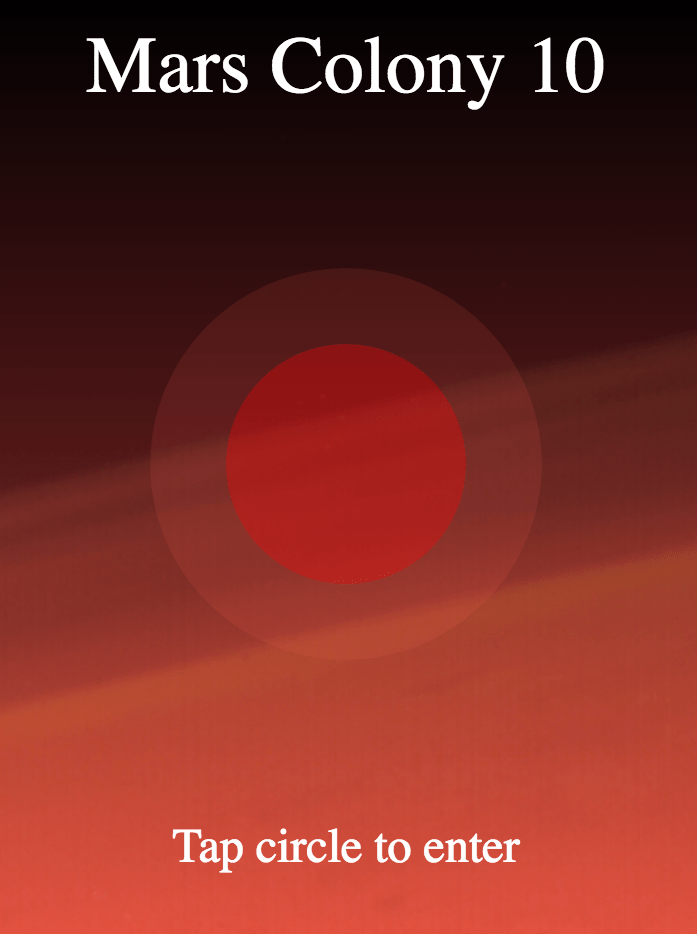

# Mars Colony 10

    

---

# Summary / Purpose

Register a colonist and start reporting your alien encounters with the ability to easily view other colonists experiences and the actions they took.

It can be a useful reference for the following:
* Creating an Angular2 project
* Using GET and POST HTTP commands to send and receive data from an external api
* creating components/services/models in angular2

---

# Technologies Used
* Angular2
* HTML5
* CSS3 transitions and Flexbox layout
* SCSS - @mixins, variables, and partials 

---

# Installation
* Clone or download the repo
* `cd` to the project root
* Run `> npm install`
* Run `> npm start` to start the development server on port 4200
* Open localhost:4200 in a web browser to view